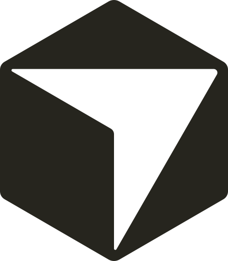

# Daniel Khojaste

<h3 align="center"><big>Full-Stack Software Developer</big></h3>

I turn ideas into polished, working software, from the first screen to the final deploy.

[LinkedIn](https://www.linkedin.com/in/aref-khojaste/) &nbsp;&nbsp; [GitHub](https://github.com/DanielKhojaste) &nbsp;&nbsp; [Email](mailto:danielkhojaste101@gmail.com)

 

## Give me your stack. Give me a challenge.

Hiring managers and recruiters: tired of reading the same resumes?

Send me your **tech stack**, a **scoped problem**, and what you want to see.  
Give me up to a week and I will turn it into something real your tech lead can review.

🟪 **Design** polished interfaces and prototypes in Figma  
🟪 **Build** clean, maintainable software across the stack  
🟪 **Test** critical flows with automated coverage  
🟪 **Document** the build clearly from setup to handoff  
🟣 **Launch** a live project you can open, use, and review

**AI-assisted or fully manual, your call. I'm more than happy to build without AI, and I'm comfortable coding live in an interview.**

## About me

I'm a full-stack developer and a graduate of Algonquin College's **Web Development & Internet Applications** program, where I made the **Dean's Honours List** three times!

Based in Canada and willing to relocate. I work across frontend, backend, REST APIs, databases, testing, and deployment, and I learn new technologies quickly by putting them to work.

## Skills

<table align="center">
  <tr>
    <th align="center">Area</th>
    <th align="center">Technologies</th>
  </tr>

<tr>
    <td align="center" valign="middle"><strong>Languages</strong></td>
    <td align="center" valign="middle">
      
    </td>
  </tr>

<tr>
    <td align="center" valign="middle"><strong>Frontend</strong></td>
    <td align="center" valign="middle">
      
    </td>
  </tr>

<tr>
    <td align="center" valign="middle"><strong>Backend & Data</strong></td>
    <td align="center" valign="middle">
      
       
      
    </td>
  </tr>

<tr>
    <td align="center" valign="middle"><strong>Testing & Tools</strong></td>
    <td align="center" valign="middle">
      
       
      
    </td>
  </tr>

<tr>
    <td align="center" valign="middle"><strong>CMS & Platforms</strong></td>
    <td align="center" valign="middle">
      
       
      
    </td>
  </tr>

<tr>
    <td align="center" valign="middle"><strong>AI Development</strong></td>
    <td align="center" valign="middle">
      
       
      
       
      <picture>
        <source media="(prefers-color-scheme: dark)" srcset="./assets/cursor-dark.svg" />
        
      </picture>
       
      <picture>
        <source media="(prefers-color-scheme: dark)" srcset="./assets/github-copilot-dark.svg" />
        
      </picture>
    </td>
  </tr>
</table>

## Featured projects

### [ApotheonAI](https://apotheon-ai.vercel.app/)

  
  
  
  
  
  
  

A multi-page AI security website built around reusable frontend components, responsive and accessible UI, structured CMS content, dynamic routes, and browser-based end-to-end testing.

### [Lineup](https://github.com/DanielKhojaste/lineup)

  
  
  
  
  

A tactical board desktop application with interactive drag-and-drop editing and a domain-driven node system designed to make new functionality easier to extend.

### [PlantPlotter](https://www.plantplotter.app/)

  
  
  
  

A stakeholder-driven team project where I worked on data extraction, software quality, deployment, debugging, pull requests, code reviews, and client feedback.

## How I like to work

🟨 **Build** end to end.

🟨 **Design** with intent.

🟨 **Test** what matters.

🟨 **Document** as I go.

🟡 **Own** the result.

 

## Get in touch

If you have a stack or a challenge in mind, send it my way.

[Email](mailto:danielkhojaste101@gmail.com) &nbsp;&nbsp; [LinkedIn](https://www.linkedin.com/in/aref-khojaste/) &nbsp;&nbsp; [GitHub](https://github.com/DanielKhojaste)

**Name the stack.**  
**Set the challenge.**  
**See it happen.**

